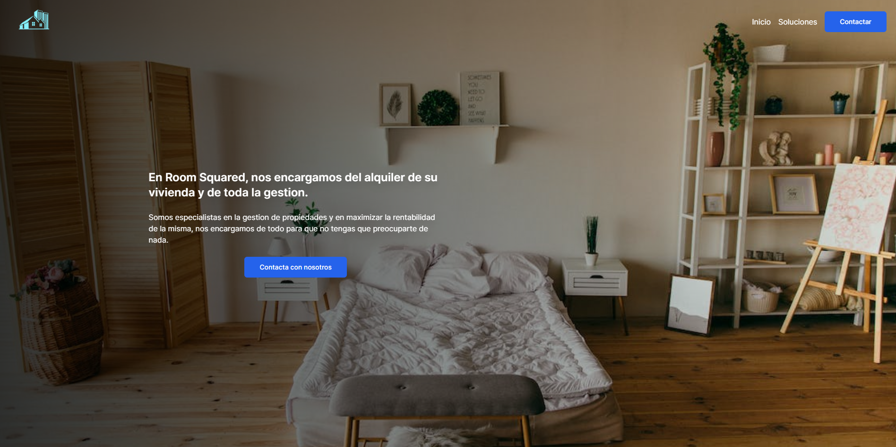
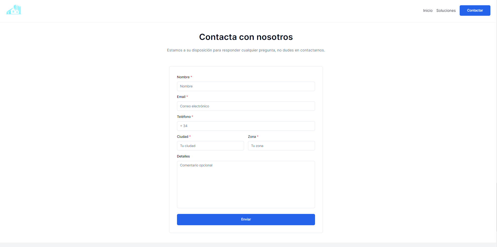

# Real Estate Static Website with NextJS 13 and TailwindCSS

 Real Estate Static Website developed using `Next.js 13`, `Tailwind CSS`, and `shadcn/ui`. It also includes a contact form that connects to an AWS Lambda function with SES to manage visitor messages.

## Contents

- [Demo](#demo)
- [Technologies Used](#technologies-used)
- [Contact](#contact)

## Demo

You can view this website [here](https://main.d2pncs0hhp6niy.amplifyapp.com/).

## Technologies Used

- **Next.js:** I used Next.js as a web development framework to create a fast and efficient website.

- **Tailwind CSS:** I used Tailwind CSS to design and style the user interface efficiently and customizably.

- **Shadcn:** Reusable components built using Radix UI and Tailwind CSS.

- **AWS Lambda and SES:** I implemented a Lambda function on AWS to handle the contact form, and I use Simple Email Service (SES) to send emails.

## Contact

If you have any questions or comments, please feel free to reach out to me:

- Email: [jer.info.dev@email.com](mailto:jer.info.dev@email.com)